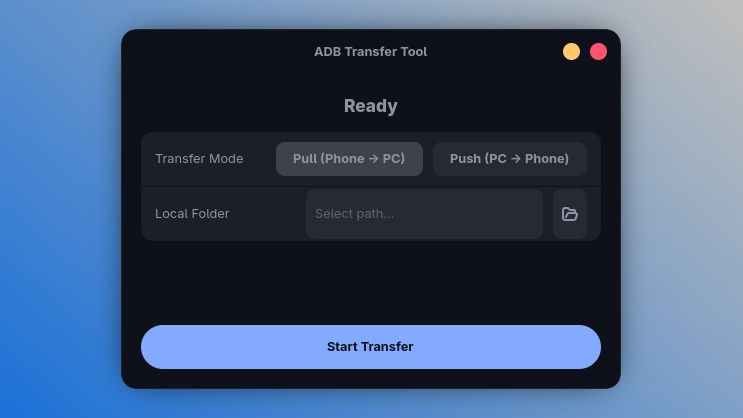

# ⚡ ADB GTK4 ADB Transfer Tool ⚡



Here you go — a clean, professional **English README** for your project, suitable for GitHub 👌
(Structured, polished, and fully aligned with what your tool actually does.)

---

# 📱⚡ ADB Transfer Tool (GTK4 + libadwaita)

A modern and fast GUI tool for transferring files between **Android ↔ Linux** using ADB.
Built with **GTK4 + libadwaita**, featuring real progress tracking, speed measurement, and full error logging.

This tool uses a `tar` + `pv` pipeline to achieve **maximum transfer speed** without compression.

---

## ✨ Features

* 🔄 **Two-way transfer modes**

  * **Pull**: Phone → PC
  * **Push**: PC → Phone

* ⚡ **High-speed transfer**
  Uses `tar` streaming — no compression — for optimal throughput.

* 📊 **Real progress bar**
  Progress is based on `pv -n` output, giving accurate percent completion.

* 🚀 **Live Speedometer**
  Shows real-time transfer speed (B/s, KB/s, MB/s).

* 🧪 **Full logging**
  All internal operations are logged to the terminal (debug, error, info).

* 🔐 **Error capturing & toast notifications**
  Any adb/tar errors are displayed inside the UI.

* 🗂️ **Automatic remote directory handling**
  Always works inside:

  ```
  /sdcard/Transfer
  ```

---

## 📦 Requirements

Make sure you have the following installed:

### On Linux:

* **Python 3.8+**
* **GTK4**
* **libadwaita**
* **PyGObject** (`python3-gi`)
* **ADB** (Android Debug Bridge)
* **tar**
* **pv**

Example (Fedora):

```bash
sudo dnf install gtk4 libadwaita python3-gobject pv adb
```

Example (Ubuntu 24.04+):

```bash
sudo apt install gir1.2-gtk-4.0 gir1.2-adw-1 python3-gi pv adb
```

---

## 🛠️ Installation

Clone the repository:

```bash
git clhttps://github.com/AsmrCodeZ-YT/ADB.git
cd adb-transfer-tool
```

Run the app:

```bash
python3 main.py
```

---

## 📁 Default Transfer Paths

| Mode | Source → Target                   |
| ---- | --------------------------------- |
| Pull | `/sdcard/Transfer` → Local folder |
| Push | Local folder → `/sdcard/Transfer` |

The directory is created automatically on the device if missing.

---

## 🖥️ How It Works Internally

### Pull (Phone → PC)

```bash
adb exec-out "cd /sdcard && tar -c -f - Transfer" \
| pv -n -s <remote_size> \
| tar -xf - -C <local_path>
```

### Push (PC → Phone)

```bash
tar -cf - -C <local_path> . \
| pv -n -s <local_size> \
| adb shell "tar -xf - -C /sdcard/Transfer"
```

This gives:

* No compression overhead
* Maximum ADB throughput
* Accurate progress measurement

---

## 🚩 Troubleshooting

### “ADB device not connected”

* Ensure USB debugging is enabled
* Run:

  ```bash
  adb devices
  ```
* Make sure you’ve accepted the RSA fingerprint

### Stuck at 0%

* `pv` or `tar` not installed
* ADB unauthorized
* Permission denied on `/sdcard/Transfer`

### Very slow transfer

* USB 2.0 cable
* Bad-quality cable
* Using USB hubs

---

## 📜 License

MIT License — free to use, modify, and distribute.

---

## 🤝 Contributing

Pull requests and improvements are welcome!
If you have ideas for features (e.g., file preview, selective transfers), feel free to create an issue.

---

If you'd like, I can also generate:
✅ A more detailed wiki
✅ Animated GIF demo
✅ Icons/appstream metadata for Linux packaging
✅ Flatpak manifest

Just tell me!